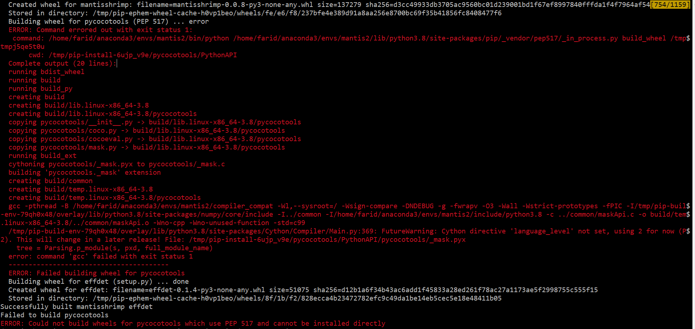

!!! danger "Important"  
    We currently only support Linux/MacOS installations

## A- Installation using pypi

### **Option 1:** Installing a non-editable package from GitHub **[Recommended]**

To install the mantisshrimp package from its GitHub repo, run the command here below. This option can be used in Google Colab,
for example, where you might install the mantisshrimp latest version (from the `master` branch)

<div class="termy">
```console
$ pip install git+git://github.com/airctic/mantisshrimp.git#egg=mantisshrimp[all] --upgrade
```
</div>

### **Option 2:** Installing an editable package from GitHub **[For Developers]**

!!! info "Note"  
    This method is used by developers who are usually either:

    - actively contributing to `mantisshrimp` project by adding new features or fixing bugs, or 

    - creating their own extensions, and making sure that their source code stay in sync with the `mantisshrimp` latest version.

All we have to do is to follow these 3 simple steps by running the following commands:

<div class="termy">
```console
$ git clone --depth=1 https://github.com/airctic/mantisshrimp.git
$ cd mantisshrimp
$ pip install .[all]
```
</div>

### **Option 3:** Installing from pypi repository **[Coming Soon!]**
 
#### All Packages
To install mantisshrimp package together with all dependencies:

<div class="termy">
```console
$ pip install mantisshrimp[all]
```
</div>

#### Mantisshrimp + Fastai
To install mantisshrimp package and only the Fastai library, run the following command:

<div class="termy">
```console
$ pip install mantisshrimp[fastai]
```
</div>

#### Mantisshrimp + Pytorch-Lightning
To install mantisshrimp package and only the Pytorch-Lightning library, run the following command:

<div class="termy">
```console
$ pip install mantisshrimp[pytorch_lightning]
```
</div>

## B- Installation using conda
Creating a conda environment is considered as a best practice because it avoids polluting the default (base) environment, and reduces dependencies conflicts. Use the following command in order to create a conda environment called **mantis**

<div class="termy">
```console
$ conda env create -n mantis
$ conda activate mantis
$ pip install git+git://github.com/airctic/mantisshrimp.git#egg=mantisshrimp[all]
```
</div>

## C- Fixing the Error: Failed building wheel for pycocotools
If you encounter the **Failed building wheel for pycocotools error** (see screenshoot here below), you can easily fix it by installing  `gcc` from your linux terminal as shown in the following steps:

<div class="termy">
```console
$ sudo apt update
$ sudo apt install gcc
```
</div>




!!! info "Note" 
    You can check out the following blog post: [3 ways to pip install a package ](https://ai-fast-track.github.io/blog/python/2020/03/17/how-to-pip-install-package.html) for more a detailed explantion on how to choose the most convenient installation option for you. 

