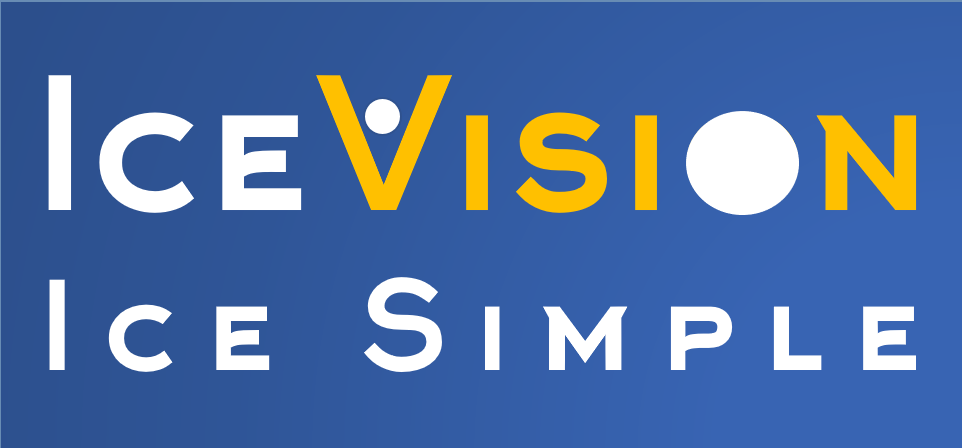
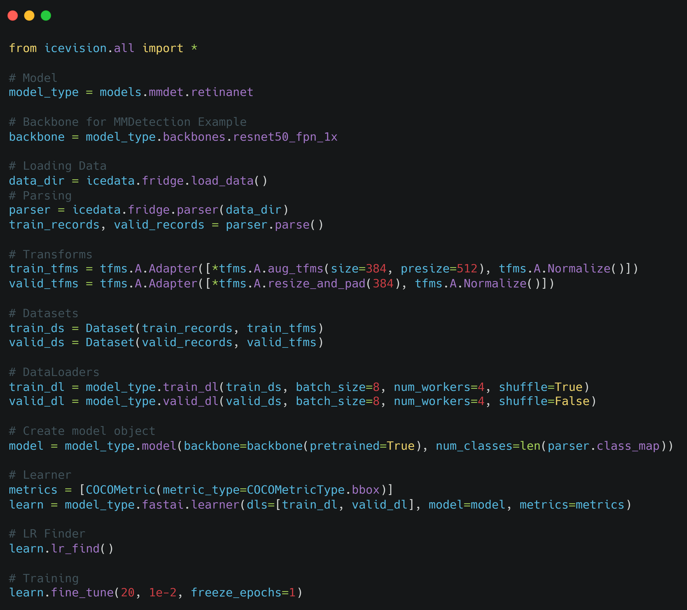

<div align="center">
  
  <h2><b>An Agnostic Object Detection Framework</b></h2>
</div>

* * * * *
>**Note: "We Need Your Help"**
    If you find this work useful, please let other people know by **starring** it,
    and sharing it. 
    Thank you!
    
<div align="center">
    
[](https://github.com/airctic/icevision/actions?query=workflow%3Atests)
[](https://airctic.com)
[](https://codecov.io/gh/airctic/icevision)
[](https://badge.fury.io/py/icevision)
[](https://pepy.tech/project/icevision)

[](https://github.com/psf/black)
[](https://github.com/airctic/icevision/blob/master/LICENSE)
[](https://discord.gg/2jqrwrQ)

</div>


* * * * *


<!-- Not included in docs - start -->
## **Contributors**

[](https://sourcerer.io/fame/lgvaz/airctic/icevision/links/0)[](https://sourcerer.io/fame/lgvaz/airctic/icevision/links/1)[](https://sourcerer.io/fame/lgvaz/airctic/icevision/links/2)[](https://sourcerer.io/fame/lgvaz/airctic/icevision/links/3)[](https://sourcerer.io/fame/lgvaz/airctic/icevision/links/4)[](https://sourcerer.io/fame/lgvaz/airctic/icevision/links/5)[](https://sourcerer.io/fame/lgvaz/airctic/icevision/links/6)[](https://sourcerer.io/fame/lgvaz/airctic/icevision/links/7)

## Installation

```bash
pip install icevision[all]
```

For more installation options, check our [docs](https://airctic.github.io/icevision/install/).

**Important:** We currently only support Linux/MacOS.
<!-- Not included in docs - end -->


## Why IceVision?

- IceVision is an Object-Detection Framework that connects to different libraries/frameworks such as Fastai, Pytorch Lightning, and Pytorch with more to come.

- Features a Unified Data API with out-of-the-box support for common annotation formats (COCO, VOC, etc.)

- The [IceData repo](https://github.com/airctic/icedata) hosts community maintained parsers and custom datasets 

- Provides flexible model implementations with pluggable backbones

- Helps researchers reproduce, replicate, and go beyond published models

- Enables practioners to get moving with object detection technology quickly


## Quick Example: How to train the **PETS Dataset**
[**Source Code**](https://airctic.github.io/icevision/examples/training/)



## Happy Learning!
If you need any assistance, feel free to:

[Join our Forum](https://discord.gg/JDBeZYK)