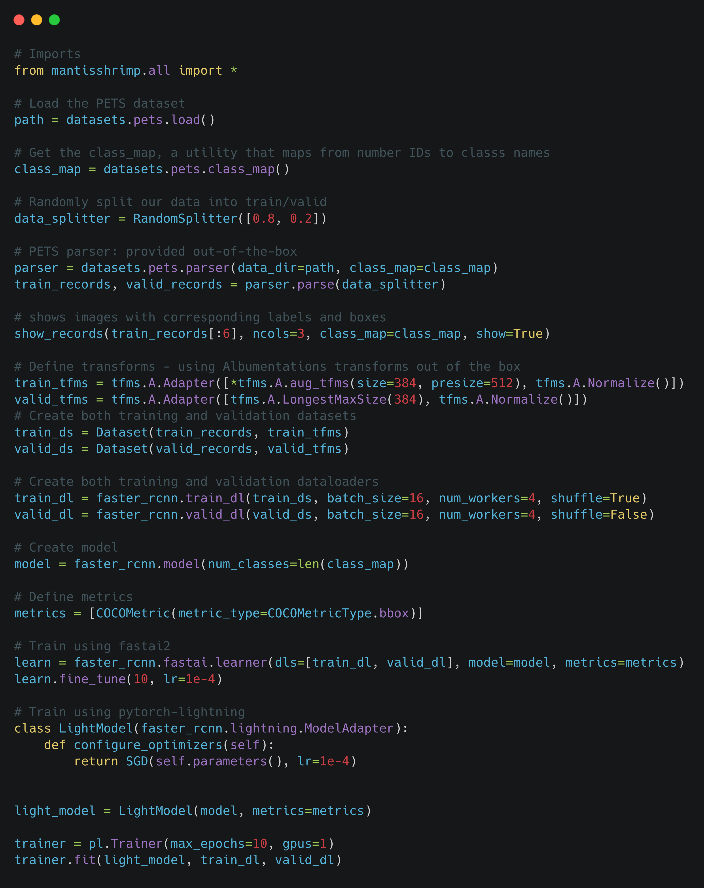

# Mantisshrimp: Agnostic Object Detection Framework
> We are both a welcoming and an open community. 
> We warmly invite you to join us either as a user or a community contributor.
> We will be happy to hear from you.

>**Note: "We Need Your Help"**
    If you find this work useful, please let other people know by **starring** it,
    and sharing it. 
    Thank you!


[](https://github.com/lgvaz/mantisshrimp/actions?query=workflow%3Atests)
[](https://lgvaz.github.io/mantisshrimp/index.html)
[](https://codecov.io/gh/lgvaz/mantisshrimp)
[](https://github.com/psf/black)
[](https://github.com/lgvaz/mantisshrimp/blob/master/LICENSE)

* * * * *


## The Problem We Are Solving

-   Object dectection datasets come in different sizes and most
    impotantly have different annotations formats ranging from the
    stanndard formarts such COCO and VOC to more self-tailored formats
-   When new object detection models are released with some source code,
    the latter is very often written in non-portable way: The source
    code is difficult to use for other datasets because of some
    hard-coded parts coupled with self developed tweaks
-   Both researchers and DL coders have to deploy a lot of effort to use
    many SOTA models for their own use-cases and/or to craft an enhanced
    model based on those already published

## Our Solution

Mantisshrimp library provides some elegant solutions in those 2
fundamental components:

**1- A Unified Data API:**

Out of the box, we offer several annotation parsers that translates
different annotation formats into a very flexibe parser:

A.  By default, we offer differents standard format parsers such as COCO
    and ROC,
B.  We host a community curated parsers where community contributors
    publish their own parsers to be shared, and therefore save time and
    energy in creating similar parsers over and over,
C.  We provide some intuitive tutorials that walk you through the steps
    of creating your own parser. Please, consider sharing it with the
    whole community.

**2- A Universal Adapter to different DL Libraries:**

A.  Mantisshrimp provides a universal adapter that allows you to hook up
    your dataset to the DL library of your choice (fastai, Pytorch
    Lightning and Pytorch), and train your model using a familiar API,
B.  Our library allows you to choose one of the public implementations
    of a given model, plug it in mantisshrimp model adapter, and
    seamlessly train your model,
C.  As a bonus, our library even allows to experiment with another DL
    library. Our tutorials have several examples showing you how to
    train a given model using both fastai and Pytorch Lightning
    libraries side by side.

## Why Mantishrimp

-   An agnostic object-detection library
-   Connects to different libraries/framework such as fastai, Pytorch
    Lightning, and Pytorch
-   Features a Unified Data API such: common Parsers (COCO, VOC, etc.)
-   Integrates community maintaned parsers for custom datasets shared on
    parsers hub
-   Provides flexible model implementations using different backbones
-   Helps both researchers and DL engineers in reproducing, replicating
    published models
-   Facilitates applying both existing and new models to standard
    datasets as well as custom datasets


## Quick Example: How to train the **PETS Dataset**
[**Source Code**](https://lgvaz.github.io/mantisshrimp/examples/training_using_fastai/)



<!-- Not included in docs -->
* * * * *
# Installation


## A- Local Installation using pypi

There are 3 ways to install mantisshrimp and its dependencies using `pip install`. 

> **Note**: You can check out the following blog post: [3 ways to pip install a package ](https://ai-fast-track.github.io/blog/python/2020/03/17/how-to-pip-install-package.html) for more a detailed explantion on how to choose the most convenient option 
for you. 


### Option 1: Installing from pypi repository **[Coming Soon!]**
 
#### All Packages
To install mantisshrimp package and both Fastai and Pytorch-Lightning libraries, run the following command:

```bash
pip install mantisshrimp[all]
```

#### Mantisshrimp + Fastai
To install mantisshrimp package and only the Fastai library, run the following command:

```bash
pip install mantisshrimp[fastai]
```

#### Mantisshrimp + Pytorch-Lightning
To install mantisshrimp package and only the Pytorch-Lightning library, run the following command:

```bash
pip install mantisshrimp[pytorch_lightning]
```

### Option 2: Installing a non-editable package from GitHub **[Already Available]**

To install the mantisshrimp package from its GitHub repo, run the command here below. This option can be used in Google Colab,
for example, where you might install the mantisshrimp latest version (from the `master` branch)

```bash
pip install git+git://github.com/lgvaz/mantisshrimp.git[all]
```

### Option 3: Installing an editable package from GitHub **[Already Available]**
> **Note:** This method is used by developers who are usually either:
>
> - actively contributing to `mantisshrimp` project by adding new features or fixing bugs, or 
> - creating their own modules, and making sure that their source code stay in sync with the `mantisshrimp` latest version.

All we have to do is to follow these 3 simple steps by running the following commands:

```bash
git clone --depth=1 https://github.com/lgvaz/mantisshrimp.git
cd mantisshrimp
pip install .[all]
```


## B- Local Installation using conda

Use the following command in order to create a conda environment called
**mantis** (the name is set in the environment.yml file)

```bash
conda env create -f environment.yml
```

### Activating mantis conda environment

To activate the newly created mantis virtual environment, run the
following command:

```bash
conda activate mantis
```

> **Note:**
> Once you activate the conda environment, follow the steps described, here above, in order to `pip install` 
> the mantisshrimp package and its dependencies: **A- Local Installation using pypi** 


### C- Common step: cocoapi Installation: for both pypi and conda installation

#### C.1- Installing **cocoapi** in Linux:

```bash
pip install "git+https://github.com/cocodataset/cocoapi.git#subdirectory=PythonAPI"
```

#### C.2- Installing **cocoapi** in Windows:

pycoco cannot be installed using the command above (see
[issue-185](https://github.com/cocodataset/cocoapi/issues/185) in the
cocoapi repository). We are using this workaround:

```bash
pip install "git+https://github.com/philferriere/cocoapi.git#egg=pycocotools&subdirectory=PythonAPI"
```

### D- Updating mantis conda environment

To update mantis conda environment, all you need to do is update the
content of your environment.yml file accordingly and then run the
following command:

```bash
conda env update -f environment.yml  --prune
```
