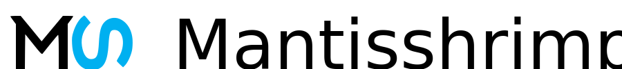
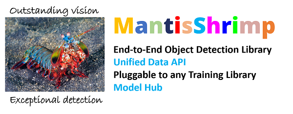

# Mantisshrimp: Agnostic Object Detection Framework

>**Note: "We Need Your Help"**
    If you find this work useful, please let other people know by **starring** it,
    and sharing it. 
    Thank you!
    
<div align="center">
    
[](https://github.com/airctic/mantisshrimp/actions?query=workflow%3Atests)
[](https://airctic.github.io/mantisshrimp/index.html)
[](https://codecov.io/gh/airctic/mantisshrimp)
[](https://github.com/psf/black)
[](https://github.com/airctic/mantisshrimp/blob/master/LICENSE)  

[](https://spectrum.chat/mantis)

</div>


* * * * *




<!-- Not included in docs - start -->
## **Contributors**

[](https://sourcerer.io/fame/lgvaz/lgvaz/mantisshrimp/links/0)[](https://sourcerer.io/fame/lgvaz/lgvaz/mantisshrimp/links/1)[](https://sourcerer.io/fame/lgvaz/lgvaz/mantisshrimp/links/2)[](https://sourcerer.io/fame/lgvaz/lgvaz/mantisshrimp/links/3)[](https://sourcerer.io/fame/lgvaz/lgvaz/mantisshrimp/links/4)[](https://sourcerer.io/fame/lgvaz/lgvaz/mantisshrimp/links/5)[](https://sourcerer.io/fame/lgvaz/lgvaz/mantisshrimp/links/6)[](https://sourcerer.io/fame/lgvaz/lgvaz/mantisshrimp/links/7)


## Installation

First follow the instructions for installing PyTorch [here](https://pytorch.org/get-started/locally/).

Then:
```bash
pip install git+git://github.com/airctic/mantisshrimp.git#egg=mantisshrimp[all]
```

For more installation options, check our [docs](https://airctic.github.io/mantisshrimp/install/).

**Important:** We currently only support Linux/MacOS.
<!-- Not included in docs - end -->


## Quick Example: How to train the **PETS Dataset**
[**Source Code**](https://airctic.github.io/mantisshrimp/examples/training/)


## The Problem We Are Solving

-   Object dectection datasets come in different sizes and most
    impotantly have different annotations formats ranging from the
    stanndard formarts such COCO and VOC to more self-tailored formats
-   When new object detection models are released with some source code,
    the latter is very often written in non-portable way: The source
    code is difficult to use for other datasets because of some
    hard-coded parts coupled with self developed tweaks
-   Both researchers and DL coders have to deploy a lot of effort to use
    many SOTA models for their own use-cases and/or to craft an enhanced
    model based on those already published

## Our Solution

Mantisshrimp library provides some elegant solutions in those 2
fundamental components:

**1- A Unified Data API**

Out of the box, we offer several annotation parsers that translates
different annotation formats into a very flexibe parser:

* By default, we offer differents standard format parsers such as COCO
  and VOC.
* We host a community curated parsers where community contributors
  publish their own parsers to be shared, and therefore save time and
  energy in creating similar parsers over and over.
* We provide some intuitive tutorials that walk you through the steps
  of creating your own parser. Please, consider sharing it with the
  whole community.

**2- A Universal Adapter to different DL Libraries**

* Mantisshrimp provides a universal adapter that allows you to hook up
  your dataset to the DL library of your choice (fastai, Pytorch
  Lightning and Pytorch), and train your model using a familiar API.
* Our library allows you to choose one of the public implementations
  of a given model, plug it in mantisshrimp model adapter, and
  seamlessly train your model.
* As a bonus, our library even allows to experiment with another DL
  library. Our tutorials have several examples showing you how to
  train a given model using both fastai and Pytorch Lightning
  libraries side by side.


## Happy Learning!
If you need any assistance, feel free to join our [forum](https://spectrum.chat/mantis).
