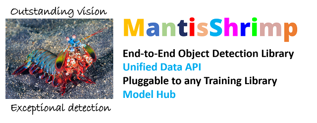

MantisShrimp
============

   MantisShrimp is in very early development, all contributions are
   welcome! Be sure to check the ``issues`` board =)

|tests| |docs| |codecov| |black| |license|

--------------

The Problem We Are Solving
--------------------------

- Object dectection datasets come in different sizes and most impotantly have different annotations formats ranging from the stanndard formarts such COCO and VOC to more self-tailored formats

- When new object detection models are released with some source code, the latter is very often written in non-portable way: The source code is difficult to use for other datasets because of some hard-coded parts coupled with self developed tweaks

- Both researchers and DL coders have to deploy a lot of effort to use many SOTA models for their own use-cases and/or to craft an enhanced model based on those already published

Our Solution
------------
Mantisshrimp library provides some elegant solutions in those 2 fundamental components:

**1- A Unified Data API:** 

Out of the box, we offer several annotation parsers that translates different annotation formats into a very flexibe parser:

A. By default, we offer  differents standard format parsers such as COCO and ROC,

B. We host a community curated parsers where community contributors publish their own parsers to be shared, and therefore save time and energy in creating similar parsers over and over (check out the Kaggle `Wheat`_ parser),
 
C. We provide some intuitive tutorials that walk you through the steps of creating your own parser. Please, consider sharing it with the whole community.

**2- A Universal Adapter to different DL Libraries:**

A. Mantisshrimp provides a universal adapter that allows you to hook up your dataset to the DL library of your choice (fastai, Pytorch Lightning and Pytorch), and train your model using a familiar API,

B. Our library allows you to choose one of the public implementations of a given model, plug it in mantisshrimp model adapter, and seamlessly train your model,

C. As a bonus, our library even allows to experiment with another DL library. Our tutorials have several examples showing you how to train a given model using both fastai and Pytorch Lightning libraries side by side.

Why Mantishrimp
---------------
- Mantisshrimp: An object-detection library
- Connects to different libraries/framework such as fastai, Pytorch Lightning, and Pytorch
- Features a Unified Data API such: common Parsers (COCO, etc.),
- Integrates community maintaned parsers for custom datasets shared on parsers hub
- Provides flexible model implementations using different backbones
- Helps both researchers and DL engineers in reproducing, replicating published models
- Facilitates applying both existing and new models to standard datasets as well as custom datasets

**Note:**  If you find this work useful, please let other people know by **staring** it. Thank you!

Hall of Fame
------------

This library is only made possible because of @all-contributors, thank you ♥️ ♥️ ♥️ 

|image0|\ |image1|\ |image2|\ |image3|\ |image4|\ |image5|\ |image6|\ |image7|

.. |image0| image:: https://sourcerer.io/fame/lgvaz/lgvaz/mantisshrimp/images/0
   :target: https://sourcerer.io/fame/lgvaz/lgvaz/mantisshrimp/links/0
.. |image1| image:: https://sourcerer.io/fame/lgvaz/lgvaz/mantisshrimp/images/1
   :target: https://sourcerer.io/fame/lgvaz/lgvaz/mantisshrimp/links/1
.. |image2| image:: https://sourcerer.io/fame/lgvaz/lgvaz/mantisshrimp/images/2
   :target: https://sourcerer.io/fame/lgvaz/lgvaz/mantisshrimp/links/2
.. |image3| image:: https://sourcerer.io/fame/lgvaz/lgvaz/mantisshrimp/images/3
   :target: https://sourcerer.io/fame/lgvaz/lgvaz/mantisshrimp/links/3
.. |image4| image:: https://sourcerer.io/fame/lgvaz/lgvaz/mantisshrimp/images/4
   :target: https://sourcerer.io/fame/lgvaz/lgvaz/mantisshrimp/links/4
.. |image5| image:: https://sourcerer.io/fame/lgvaz/lgvaz/mantisshrimp/images/5
   :target: https://sourcerer.io/fame/lgvaz/lgvaz/mantisshrimp/links/5
.. |image6| image:: https://sourcerer.io/fame/lgvaz/lgvaz/mantisshrimp/images/6
   :target: https://sourcerer.io/fame/lgvaz/lgvaz/mantisshrimp/links/6
.. |image7| image:: https://sourcerer.io/fame/lgvaz/lgvaz/mantisshrimp/images/7
   :target: https://sourcerer.io/fame/lgvaz/lgvaz/mantisshrimp/links/7

Quick Start: Use Mantisshrimp Docker Container
----------------------------------------------
To jumpstart using mantisshrimp package without manually installing it and its dependencies, use our docker container!

Please, follow the 3 steps:

1. Install Docker by following the instructions shown here: https://docs.docker.com/engine/install/ (Only if Docker is not already installed)

2. Run `docker pull mantisshrimp`, in your terminal

3. Run `docker run -it mantisshrimp`, in your terminal  

Enjoy!

Manual Install
--------------

Install pytorch via your preferred way.

.. code:: bash

   pip install git+git://github.com/lgvaz/mantisshrimp.git
   pip install -U 'git+https://github.com/cocodataset/cocoapi.git#subdirectory=PythonAPI'

Quick Example: How to train the **Wheat Dataset**
-------------------------------------------------

.. code:: python

   from mantisshrimp.imports import *
   from mantisshrimp import *
   import pandas as pd
   import albumentations as A

   source = Path("/home/lgvaz/.data/wheat")
   df = pd.read_csv(source / "train.csv")
   df.head()

   # Custom parser
   data_splitter = RandomSplitter([.8, .2])
   parser = WheatParser(df, source / "train")
   train_rs, valid_rs = parser.parse(data_splitter)

   # shows images with corresponding labels and boxes
   show_record(train_rs[0], label=False)

   # Transform: supporting albumentations transforms out of the box
   train_tfm = AlbuTransform([A.Flip()])

   # Create both training and validation datasets
   train_ds = Dataset(train_rs, train_tfm)
   valid_ds = Dataset(valid_rs)

   # Create both training and validation dataloaders
   train_dl = model.dataloader(train_ds, shuffle=True, batch_size=8, num_workers=2)
   valid_dl = model.dataloader(valid_ds, batch_size=8, num_workers=2)

   # Use pre-trained backbone
   resnet_101_backbone = MantisFasterRCNN.get_backbone_by_name("resnet101", fpn=True, pretrained=True)

   # Create model
   model = WheatModel(n_class=2, backbone=resnet_101_backbone)

   # Train (fit) model
   trainer = Trainer(max_epochs=2, gpus=1)
   trainer.fit(model, train_dl, valid_dl)

Tutorials
^^^^^^^^^
`Wheat`_ : shows how to create a custom parser (WheatParser), and train the **Wheat dataset**

`Wheat-Detr`_ : shows how to use a custom parser (WheatParser), and train the **Wheat dataset** using Detr

`Penn-Fundan`_ : shows how to use the predefined COCO parser, and train the **Penn-Fundan dataset** using Detr

Be sure to also check the other tutorials in the `tutorials`_ folder.

Contributing
------------
Check out our `contributing guide`_.

FAQs and Feature Requests
--------------------------

Please check out our `FAQs`_ page. For Feature Requests and more questions raise a github `issue`_.

We will be happy to assist you.

.. _Wheat: https://lgvaz.github.io/mantisshrimp/tutorials/wheat.html
.. _Wheat-Detr: https://lgvaz.github.io/mantisshrimp/tutorials/hub_detr_finetune_wheat.html
.. _Penn-Fundan: https://lgvaz.github.io/mantisshrimp/tutorials/hub_detr_finetune_pennfundan.html
.. _tutorials: tutorials/
.. _contributing guide: https://lgvaz.github.io/mantisshrimp/contributing.html
.. _FAQs: https://lgvaz.github.io/mantisshrimp/faqs.html
.. _issue: https://github.com/lgvaz/mantisshrimp/issues/

.. |tests| image:: https://github.com/lgvaz/mantisshrimp/workflows/tests/badge.svg?event=push
   :target: https://github.com/lgvaz/mantisshrimp/actions?query=workflow%3Atests
.. |codecov| image:: https://codecov.io/gh/lgvaz/mantisshrimp/branch/master/graph/badge.svg
   :target: https://codecov.io/gh/lgvaz/mantisshrimp
.. |black| image:: https://img.shields.io/badge/code%20style-black-000000.svg
   :target: https://github.com/psf/black
.. |license| image:: https://img.shields.io/badge/License-Apache%202.0-blue.svg
   :target: https://github.com/lgvaz/mantisshrimp/blob/master/LICENSE
.. |docs| image:: https://github.com/lgvaz/mantisshrimp/workflows/docs/badge.svg
   :target: https://lgvaz.github.io/mantisshrimp/index.html

