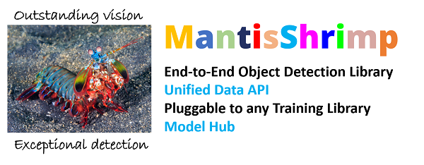

# Mantisshrimp: Agnostic Object Detection Framework
    We are welcoming and open community. 
    You are very welcome to join us either as a user or a community contributor.
    [Join our Slack](#community) and send us a message to either Lucas or Farid.
    We will be happy to hear from you.
​
##
> MantisShrimp is in very early development, all contributions are
> welcome! Be sure to check the `issues` board =)
​

[](https://github.com/lgvaz/mantisshrimp/actions?query=workflow%3Atests)
[](https://lgvaz.github.io/mantisshrimp/index.html)
[](https://codecov.io/gh/lgvaz/mantisshrimp)
[](https://github.com/psf/black)
[](https://github.com/lgvaz/mantisshrimp/blob/master/LICENSE)
​
* * * * *
​

​
## The Problem We Are Solving

-   Object dectection datasets come in different sizes and most impotantly have different annotations  
formats ranging from the standard formarts such COCO and VOC to more self-tailored formats.

-   When new object detection models are released with some source code,
    the latter is very often written in non-portable way: The source
    code is difficult to use for other datasets because of some
    hard-coded parts coupled with self developed tweaks.

-   Both researchers and DL coders have to deploy a lot of effort to use
    many SOTA models for their own use-cases and/or to craft an enhanced
    model based on those already published.
​
## Our Solution
​
Mantisshrimp library provides some elegant solutions in those 2
fundamental components:

**1- A Unified Data API:**

Out of the box, we offer several annotation parsers that translates
different annotation formats into a very flexibe parser:

A. By default, we offer differents standard format parsers such as COCO and VOC,

B.  We host a community curated parsers where community contributors publish their own parsers to be shared, and therefore save time and energy in creating similar parsers over and over.

C.  We provide some intuitive tutorials that walk you through the steps of creating your own parser. Please, consider sharing it with the whole community.

**2- A Universal Adapter to different DL Libraries:**

A.  Mantisshrimp provides a universal adapter that allows you to hook up your dataset to the DL library of your choice (fastai, Pytorch Lightning and Pytorch), and train your model using a familiar API.

B.  Our library allows you to choose one of the public implementations of a given model, plug it in mantisshrimp model adapter, and seamlessly train your model,

C.  As a bonus, our library even allows to experiment with another DL library. Our tutorials have several examples showing you how to train a given model using both fastai and Pytorch Lightning libraries side by side.
​
## Why Mantishrimp

-   An agnostic object-detection library
-   Connects to different libraries/framework such as fastai, Pytorch
    Lightning, and Pytorch
-   Features a Unified Data API such: common Parsers (COCO, VOC, etc.)
-   Integrates community maintaned parsers for custom datasets shared on
    parsers hub
-   Provides flexible model implementations using different backbones
-   Helps both researchers and DL engineers in reproducing, replicating
    published models
-   Facilitates applying both existing and new models to standard
    datasets as well as custom datasets

**Note:** If you find this work useful, please let other people know by **starring** it. Thank you!
​
​
## Quick Example: How to train the **PETS Dataset**
​
``` {.sourceCode .python}
from mantisshrimp.imports import *
from mantisshrimp import *
import albumentations as A
​
# Load the PETS dataset
path = datasets.pets.load()
​
# split dataset lists
data_splitter = RandomSplitter([.8, .2])
​
# PETS parser: provided out-of-the-box
parser = datasets.pets.parser(path)
train_records, valid_records = parser.parse(data_splitter)
​
# For convenience
CLASSES = datasets.pets.CLASSES
​
# shows images with corresponding labels and boxes
records = train_records[:6]
show_records(records, ncols=3, classes=CLASSES)
​
# ImageNet stats
imagenet_mean, imagenet_std = IMAGENET_STATS
​
# Transform: supporting albumentations transforms out of the box
# Transform for the train dataset
train_tfms = AlbuTransform(
    [
        A.LongestMaxSize(384),
        A.RandomSizedBBoxSafeCrop(320, 320, p=0.3),
        A.HorizontalFlip(),
        A.ShiftScaleRotate(rotate_limit=20),
        A.RGBShift(always_apply=True),
        A.RandomBrightnessContrast(),
        A.Blur(blur_limit=(1, 3)),
        A.Normalize(mean=imagenet_mean, std=imagenet_std),
    ]
)
​
# Transform for the validation dataset
valid_tfms = AlbuTransform(
    [
        A.LongestMaxSize(384),
        A.Normalize(mean=imagenet_mean, std=imagenet_std),
    ]
)   
​
# Create both training and validation datasets
train_ds = Dataset(train_records, train_tfms)
valid_ds = Dataset(valid_records, valid_tfms)
​
# Create both training and validation dataloaders
train_dl = model.dataloader(train_ds, batch_size=16, num_workers=4, shuffle=True)
valid_dl = model.dataloader(valid_ds, batch_size=16, num_workers=4, shuffle=False)
​
# Create model
model = MantisFasterRCNN(num_classes= len(CLASSES))
​
# Training the model using fastai2
from mantisshrimp.engines.fastai import *
learn = rcnn_learner(dls=[train_dl, valid_dl], model=model)
learn.fine_tune(10, lr=1e-4)
​
# Training the model using Pytorch-Lightning
from mantisshrimp.engines.lightning import *
​
class LightModel(RCNNLightningAdapter):
   def configure_optimizers(self):
       opt = SGD(self.parameters(), 2e-4, momentum=0.9)
       return opt
​
light_model = LightModel(model)
trainer = Trainer(max_epochs=3, gpus=1)
trainer.fit(light_model, train_dl, valid_dl)
```
​
## Streamlit Demo
​
We provide a nice demo using [streamlit](https://www.streamlit.io/). If
streamlit is not already install, run the following command, from the
terminal to install it:
​
``` {.sourceCode .bash}
pip install streamlit
```
​
Simply run the following in your terminal. It should start a demo in
your browser. It will show you one of our trained models as a pet
detector !!
​
``` {.sourceCode .bash}
streamlit run https://raw.githubusercontent.com/oke-aditya/mantisshrimp_streamlit/master/app.py
```
​
[Here](https://github.com/oke-aditya/mantisshrimp_streamlit) is the
source code for the demo.
​
You can also use it as template when creating your own streamlit apps
with mantisshrimp.
​
​
## Contributing
​
You can follow the [Contributing Guide](https://ai-fast-track.github.io/mantisshrimp/contributing/) to become a contributor.
​
If you don't know where to start, please join our community on [Slack](https://autokeras.com/#community) and ask us.
We will help you get started!
​
​
## Feature Requests and questions
​
For Feature Requests and more questions raise a github
[issue](https://github.com/lgvaz/mantisshrimp/issues/). We will be happy
to assist you.
​
Be sure to check the
[documentation](https://lgvaz.github.io/mantisshrimp/index.html).